

# 🏭 AIFactory Hub

**Development Engineering AI Suite** — A unified Qt 6 + QML desktop platform
for AI-powered content creation, data analysis, engineering, and coding automation.

**🌐 Live Showcase:** [hamda-chaouch.github.io/aifactory-hub-showcase](https://hamda-chaouch.github.io/aifactory-hub-showcase/)

> ⚠️ **Source code is proprietary.** This site contains documentation
> and screenshots only. For licensing inquiries, see [Contact](contact/).

---

## 📦 Modules

| Module | Mission |
| :--- | :--- |
| 🎨 **AI Media Studio** | Auto Content Factory · Manual Content Factory · Images · Videos · 3D |
| 📊 **Data & Knowledge Studio** | Documents · PDF · RAG · Statistics · Analysis |
| ⚙️ **Engineering Studio** | PCB · CAD · Robotics · Code · Datasheets |
| 🤖 **Hamda Agent** | AI Coding & Automation Agent |

---

---

## 📸 Screenshots

### 🏠 Home — 4 Module Cards

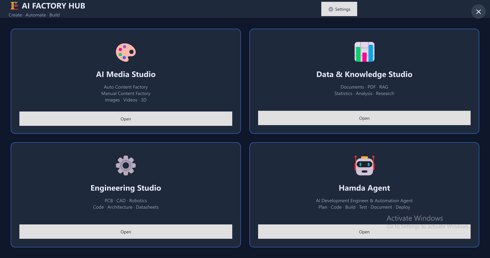

The hub presents 4 unified workspaces: AI Media Studio, Data & Knowledge Studio,
Engineering Studio, and Hamda Agent.

---

### 🎨 AI Media Studio

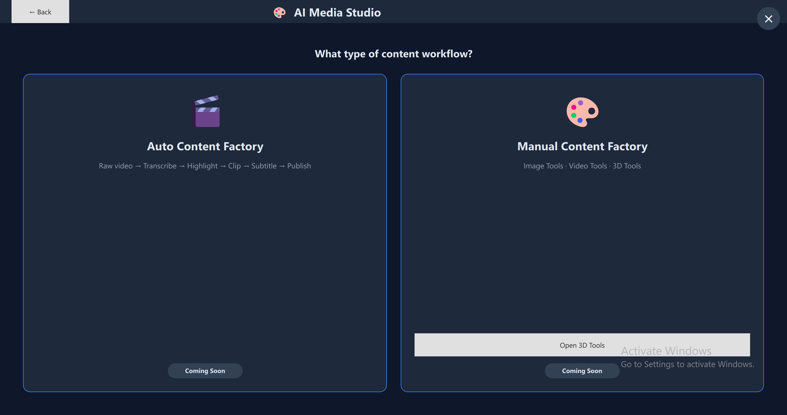

Choose between the **Auto Content Factory** (batch pipeline) or the
**Manual Content Factory** (interactive image/video/3D tools).

---

### 📊 Data & Knowledge Studio

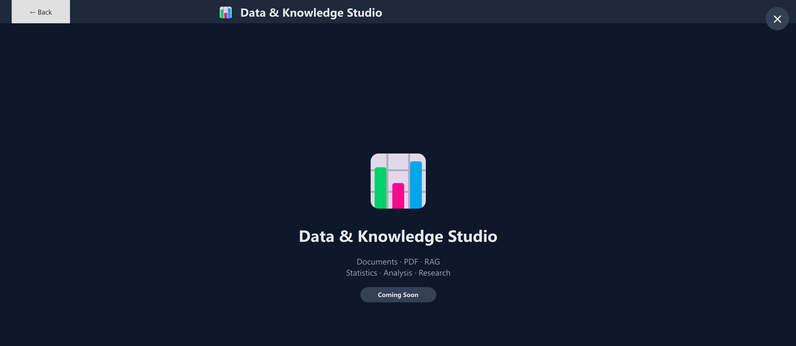

Documents · PDF · RAG · Statistics · Analysis · Research — all in one workspace.

---

### ⚙️ Engineering Studio

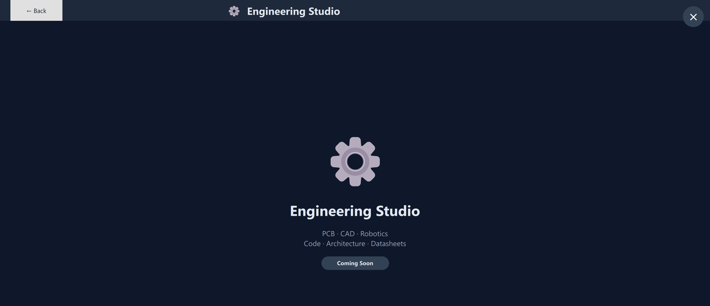

PCB · CAD · Robotics · Code · Architecture · Datasheets analysis.

---

### 🤖 Hamda Agent

AI Development Engineer & Automation Agent —
Plan · Code · Build · Test · Document · Deploy.

---

### 🧊 3D Tools

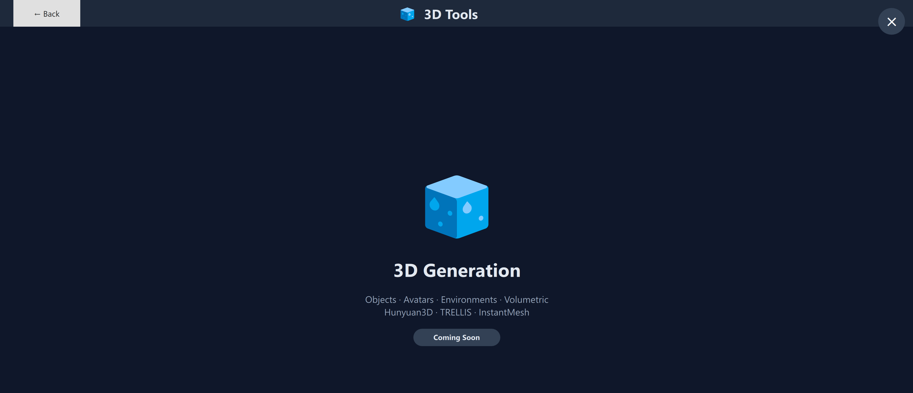

Object, avatar, environment, and volumetric generation via
Hunyuan3D · TRELLIS · InstantMesh.

---

## ⚙️ Settings

### Settings Hub

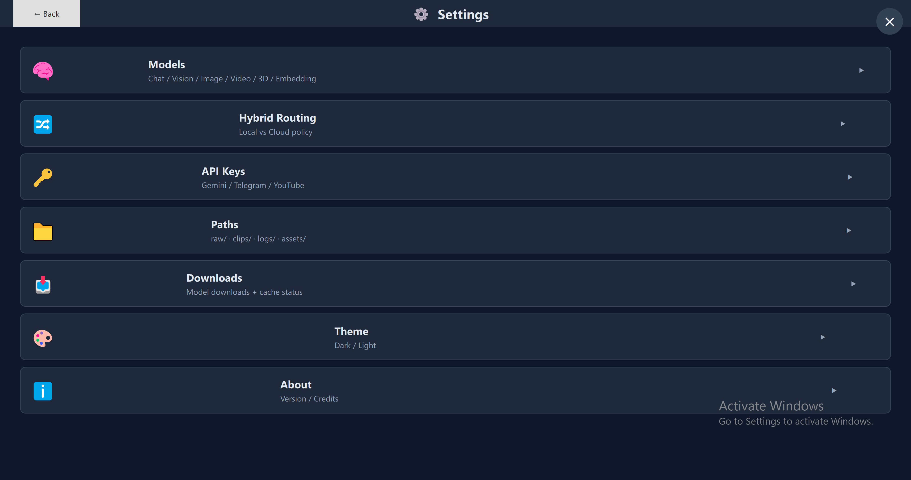

Central access to Models, Hybrid Routing, API Keys, Paths, Downloads, Theme, and About.

---

### 🧠 Models — Chat / Coding / Vision

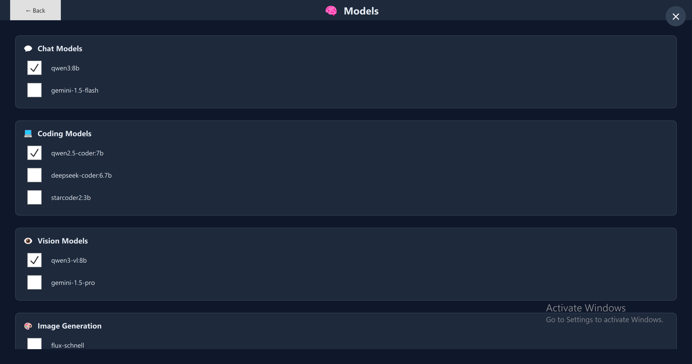

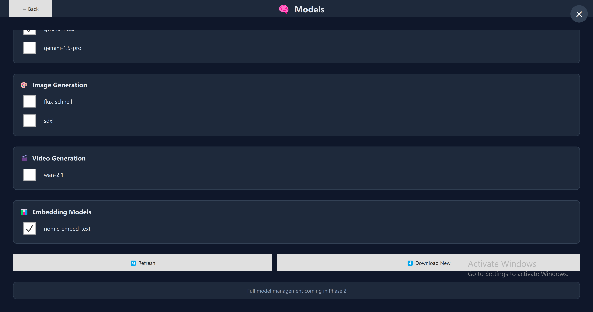

Independent categories: **Chat**, **Coding**, **Vision**, **Image Generation**,
**Video Generation**, and **Embedding** models.

---

### 🔀 Hybrid Routing

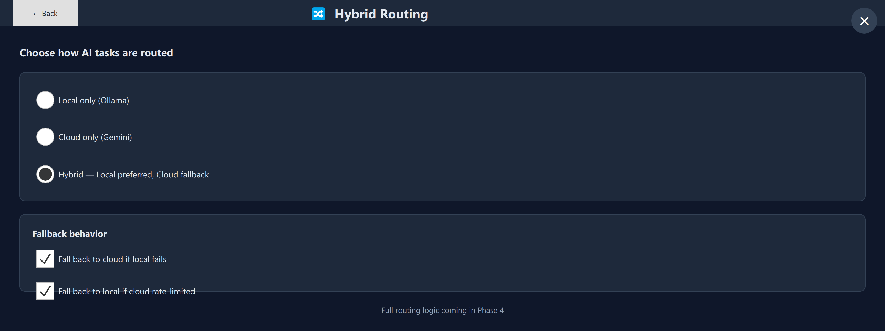

Choose between Local-only (Ollama), Cloud-only (Gemini), or Hybrid with automatic fallback.

---

### 🔑 API Keys

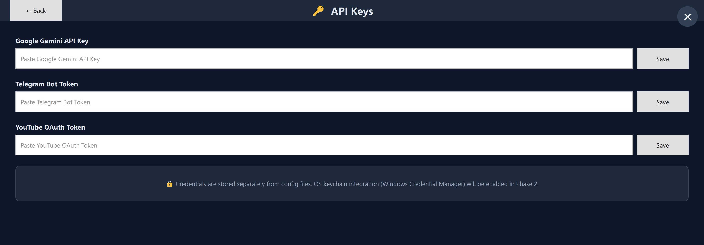

Secure credential storage — separated from config files.

---

### 📁 Paths

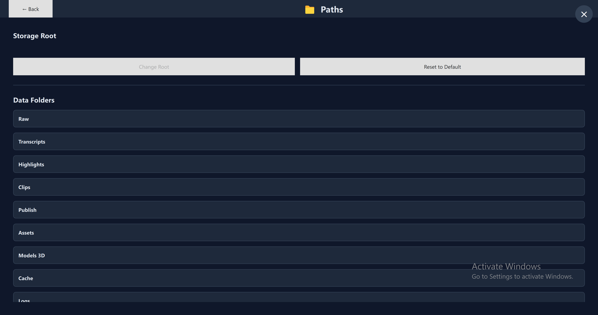

Live view of the storage root and every data folder.

---

### 📥 Downloads

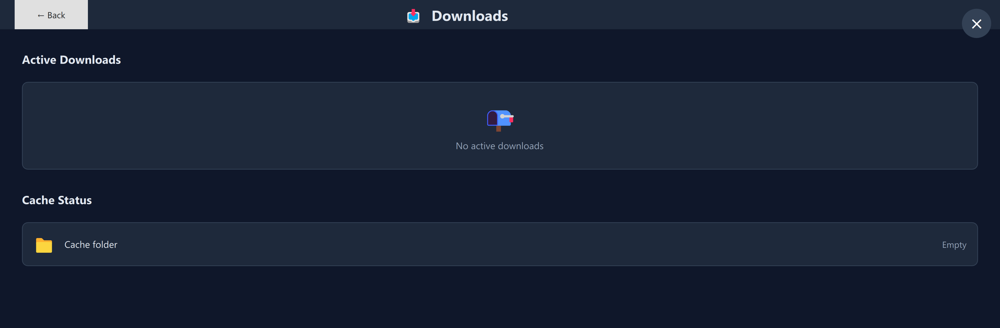

Monitor active downloads and cache status.

---

### 🎨 Theme — Dark & Light

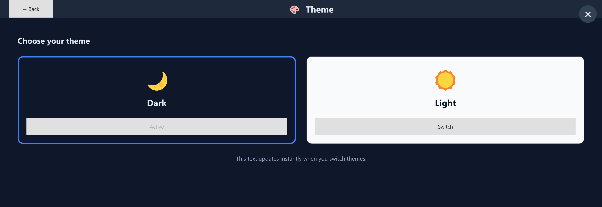

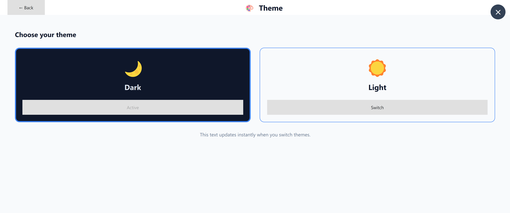

Full live theme switching. Preview cards always reflect their own theme
regardless of the active mode.

---

### ℹ️ About

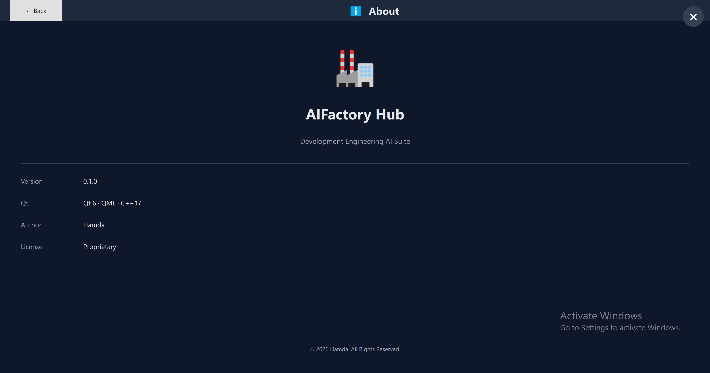

Version, Qt stack, author, and license.

---

---

## 📚 Documentation

- [Architecture](docs/ARCHITECTURE)
- [Roadmap](docs/ROADMAP)
- [Features](docs/FEATURES)
- [Contributors](contributors/CONTRIBUTORS.md)
- [Contact](contact/)

---

## 🛠️ Technology

Qt 6 · C++17 · QML · Ollama · Gemini · ComfyUI · FFmpeg · whisper.cpp

---

*Source code is proprietary. Repository is for showcase only.*